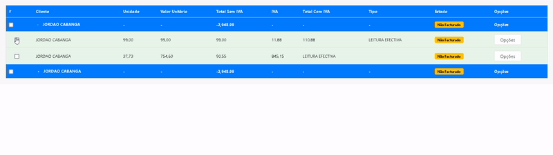

# Tree-Table

**Tree-Table** é uma biblioteca para Angular que permite criar tabelas hierárquicas interativas (em formato de árvore). Com suporte para seleção, expansão de linhas, opções personalizáveis e eventos integrados, a biblioteca é ideal para exibir dados estruturados de forma clara e eficiente.

## Instalação

Para instalar a biblioteca, utilize npm ou yarn:

```bash
npm install tree-table
```

Ou com yarn:

```bash
yarn add tree-table
```

## Uso Básico



### Exemplo de Componente

#### HTML

```html
<lib-tree-table
  [rows]="tableData"
  [columns]="columns"
  [showCheckbox]="true"
  [showOptions]="true"
  [options]="options"
  [optionStyle]="optionStyles"
  (parentSelectionChanged)="handleParentSelection($event)"
  (childSelectionChanged)="handleChildSelection($event)"
  (rowExpanded)="handleRowExpanded($event)"
  (optionsClicked)="handleOptionsClick($event)"
  (onItemClick)="handleItemClick($event)"
></lib-tree-table>

<div class="modal fade" id="exampleModal" tabindex="-1" aria-labelledby="exampleModalLabel" aria-hidden="true">
  <div class="modal-dialog">
    <div class="modal-content">
      <div class="modal-header">
        <h1 class="modal-title fs-5" id="exampleModalLabel">Título do Modal</h1>
        <button type="button" class="btn-close" data-bs-dismiss="modal" aria-label="Close"></button>
      </div>
      <div class="modal-body">
        Conteúdo do modal.
      </div>
      <div class="modal-footer">
        <button type="button" class="btn btn-secondary" data-bs-dismiss="modal">Fechar</button>
        <button type="button" class="btn btn-primary">Salvar Alterações</button>
      </div>
    </div>
  </div>
</div>
```


#### TypeScript

```typescript
import { BrowserModule } from '@angular/platform-browser';
import { NgModule } from '@angular/core';

import { AppComponent } from './app.component';
import { TreeTableLibModule } from 'projects/tree-table-lib/src/public-api';

@NgModule({
  declarations: [
    AppComponent
  ],
  imports: [
    TreeTableLibModule,
    BrowserModule
  ],
  providers: [],
  bootstrap: [AppComponent]
})
export class AppModule { }
```

```typescript
import { Component } from '@angular/core';
import { Column, TableRow, TableRowOptions, TableRowOptionStyle } from 'tree-table';

@Component({
  selector: 'app-root',
  templateUrl: './app.component.html',
})
export class AppComponent {
  columns: Column[] = [
    { field: 'name', header: 'Nome', type: 'text', width: '150px' },
    { field: 'price', header: 'Preço', type: 'currency' },
  ];

  tableData: TableRow[] = [
    {
      id: 1,
      name: 'Produto A',
      price: 100,
      isExpanded: true,
      children: [
        { id: 101, name: 'Variante A1', price: 50 },
        { id: 102, name: 'Variante A2', price: 60 },
      ],
    },
    {
      id: 2,
      name: 'Produto B',
      price: 200,
    },
  ];

  options: TableRowOptions[] = [
    { id: 1, type: 'button', buttonAtts: { dataBsToggle: 'modal', dataBsTarget: '#exampleModal' } },
  ];

  optionStyles: TableRowOptionStyle = {
    buttonStyles: { color: 'blue', fontWeight: 'bold' },
  };

  handleParentSelection(event: any) {
    console.log('Parent selection changed:', event);
  }

  handleChildSelection(event: any) {
    console.log('Child selection changed:', event);
  }

  handleRowExpanded(event: any) {
    console.log('Row expanded:', event);
  }

  handleOptionsClick(event: any) {
    console.log('Option clicked:', event);
  }

  handleItemClick(event: any) {
    console.log('Item clicked:', event);
  }
}
```

---

## API

### Atributos de Entrada (Inputs)

| Propriedade            | Tipo               | Descrição                                                                 |
|------------------------|--------------------|---------------------------------------------------------------------------|
| `[rows]`               | `TableRow[]`      | Dados que compõem as linhas da tabela.                                   |
| `[columns]`            | `Column[]`        | Definições de colunas da tabela.                                         |
| `[showCheckbox]`       | `boolean`         | Controla a exibição de checkboxes para seleção de linhas.                |
| `[showOptions]`        | `boolean`         | Controla a exibição de opções na linha.                                  |
| `[options]`            | `TableRowOptions[]` | Configurações das opções exibidas para cada linha.                      |
| `[optionStyle]`        | `TableRowOptionStyle` | Estilos personalizados aplicados às opções da linha.                  |

### Eventos (Outputs)

| Evento                     | Tipo                  | Descrição                                                                 |
|----------------------------|-----------------------|---------------------------------------------------------------------------|
| `(parentSelectionChanged)` | `EventEmitter<any>`  | Disparado quando a seleção de um item pai muda.                          |
| `(childSelectionChanged)`  | `EventEmitter<any>`  | Disparado quando a seleção de um item filho muda.                        |
| `(rowExpanded)`            | `EventEmitter<any>`  | Disparado ao expandir uma linha para mostrar seus filhos.                |
| `(optionsClicked)`         | `EventEmitter<any>`  | Disparado quando uma opção de linha é clicada.                           |
| `(onItemClick)`            | `EventEmitter<any>`  | Disparado quando uma célula ou item é clicado.                           |

---

## Interfaces Principais

### `Column`
Define a estrutura de uma coluna da tabela.

```typescript
interface Column {
  field: string;
  header: string;
  type?: 'text' | 'number' | 'currency' | 'estado' | 'button';
  typeHeader?: 'text';
  width?: string;
  visible?: boolean;
}
```

### `TableRow`
Define a estrutura de uma linha da tabela.

```typescript
interface TableRow {
  id: number;
  [key: string]: any;
  isExpanded?: boolean;
  isSelected?: boolean;
  children?: TableRowChild[];
}
```

### `TableRowChild`
Define a estrutura de um item filho em uma linha da tabela.

```typescript
interface TableRowChild {
  [key: string]: any;
  isSelected?: boolean;
  isExpanded?: boolean;
}
```

### `TableRowOptionStyle`
Define estilos customizáveis para as opções de linha da tabela.

```typescript
interface TableRowOptionStyle {
  dropdownContainerStyles?: Record<string, string>;
  buttonStyles?: Record<string, string>;
  dropdownMenuStyles?: Record<string, string>;
  dropdownItemStyles?: Record<string, string>;
}
```

### `TableRowOptions`
Define opções adicionais para ações específicas nas linhas.

```typescript
interface TableRowOptions {
  id: number;
  [key: string]: any;
  type?: 'link' | 'button';
  buttonAtts?: TableRowOptionsButtonAtts;
  linkAtts?: TableRowOptionsLinkAtts;
}
```

### `TableRowOptionsButtonAtts`
Atributos para botões utilizados nas opções de linha.

```typescript
interface TableRowOptionsButtonAtts {
  dataBsToggle?: string;    // Pode ser alterado dinamicamente
  dataBsTarget?: string;
}
```

### `TableRowOptionsLinkAtts`
Atributos para links utilizados nas opções de linha.

```typescript
interface TableRowOptionsLinkAtts {
  href?: string;
}
```

---

## Informações do Autor


Desenvolvido por **Manuel  Freitas**.

- **GitHub**: [manuelfritasc](https://github.com/manuelfreitasc)
- **Email**: manuelfreitashd@gmail.com

---

## Contribuindo

Contribuições são bem-vindas! Para contribuir, siga os seguintes passos:

1. Faça um fork do repositório.
2. Crie uma nova branch com sua funcionalidade ou correção de bug: `git checkout -b minha-branch`.
3. Envie suas alterações: `git commit -m 'Minha contribuição'`.
4. Submeta um pull request no repositório principal.

---

## Licença

Distribuído sob a licença **MIT**. Consulte o arquivo `LICENSE` para mais detalhes.
